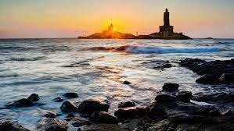
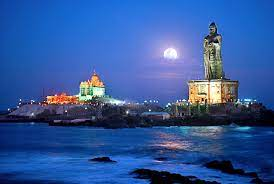
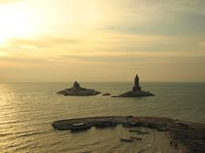
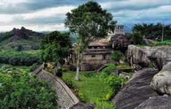

# Table of Content

- [ ] Place name
- [ ] Images
- [ ] Links
- [ ] Information about Spot

 # Kanyakumari - South India 

 # Pictures 

 # KanyaKumari - Evening view

 

 # KanyaKumari - Night view

 

 # KanyaKumari - Early Morning view

 

 # Vattakotai -  Morning view

 

 # external Links about the Places

 ## Vattakotai 

 Vattakotai [Vattakotai -click here](https://en.wikipedia.org/wiki/Vattakottai_Fort)

 ## Kanyakumari

 Kanyakumari [Kanyakumari - click here](https://en.wikipedia.org/wiki/Kanyakumari)

 # Information about the Places

 ## Kanyakumari

 Kanyakumari (US: /kənˈjʌkʊmɑːriː/); lit. "The Virgin Princess" (also known as Cape Comorin) is a town in Kanyakumari District in the state of Tamil Nadu in India. It is the southern tip of Indian subcontinent. The southernmost town in mainland India, it is sometimes referred to as 'The Land's End'.

A popular tourist destination in India, it is famous for its unique ocean sunrise, sunset and moonrise, the 41-metre (133 ft) Thiruvalluvar Statue and Vivekananda Rock Memorial off the coast, and as a pilgrimage centre.[1] Lying at the tip of peninsular India, Kanyakumari is bordered on the west, south and east by the Laccadive Sea.[2] It has a coastal line of 71.5 kilometres (44.4 mi) stretched on the three sides.[3]

## Vattakotai

 Vattakottai Fort (or 'Circular Fort') is a seaside fort near Kanyakumari, Tamil Nadu the southern tip of India. It was built in the 18th century as a coastal defence-fortification and barracks in the erstwhile Travancore kingdom.

It was constructed in the 18th century by Punachal/Elakkara Valiyaveetil Marthandan Chempakaraman Pillai for the kings of Travancore. Marthanda Pillai was born in an aristocratic house in Punachal Elakkara near Kuzhikode near Palliyadi in Kanyakumari district. (Then South Travancore). The house was a house that was associated with the royal family. Marthanda Pillai was born in the month of May 903 in Bharani Nakshatra, the son of Neelamma Pillai, a member of the said house, and Iravikurup, the bodyguard of Marthanda Varma. Later it was modified under the supervision of Captain Eustachius De Lannoy, an ex-Dutch naval officer of the Dutch East India Company, who became commander of the Travancore Army (the very army that defeated him in the Battle of Colachel) in the 18th century, after he earned the trust of the Travancore King Marthanda Varma. De Lannoy reconstructed Vattakottai, as part of the defence-fortifications he undertook throughout Travancore.

## Nagercoil

Nagercoil ("Temple of the Nāgas", Nagaraja- Hindu Temple) is a city and administrative headquarters of Kanyakumari District in Tamil Nadu, India. Situated close to the tip of the Indian peninsula, it lies on an undulating terrain between the Western Ghats and the Arabian Sea. Nagercoil Corporation is the 12th biggest city of Tamil Nadu.[3][4]

Nagaraja Temple at Nagercoil
The present city of Nagercoil grew around Kottar, a mercantile town that dates back to the Sangam period.[5] Kottar is now a locality within the city limits. For 735 years it was a central part of the erstwhile Travancore kingdom and later Kerala State, till almost a decade after India's independence from Britain in 1947. In 1956, Kanyakumari District, along with the town, was merged with Tamil Nadu.

With a maturing Technology startup ecosystem, the city is one of the 50 Indian cities to be ranked in the World Startup Index of 1,000 cities.[6] Nagercoil is a centre for a range of economic activities in the small but densely-populated Kanyakumari District. Economic activities in around the city include tourism, wind energy, IT services, marine fish production and exports, rubber and cloves plantations, agro-crops, floral production, manufacture of fishnets, rubber products among other activities.[7]